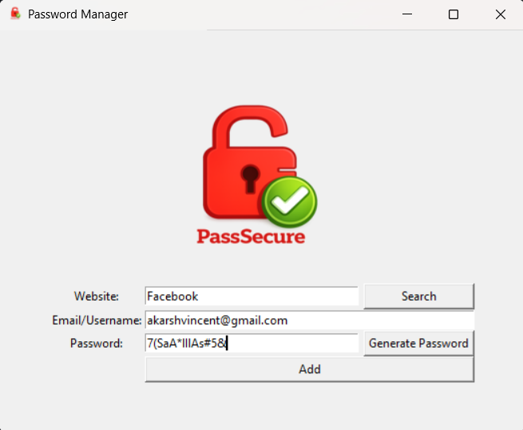
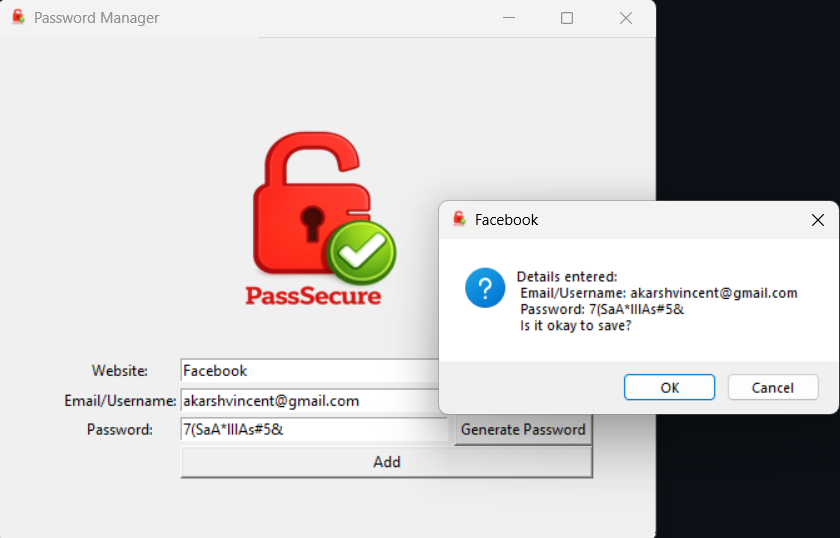
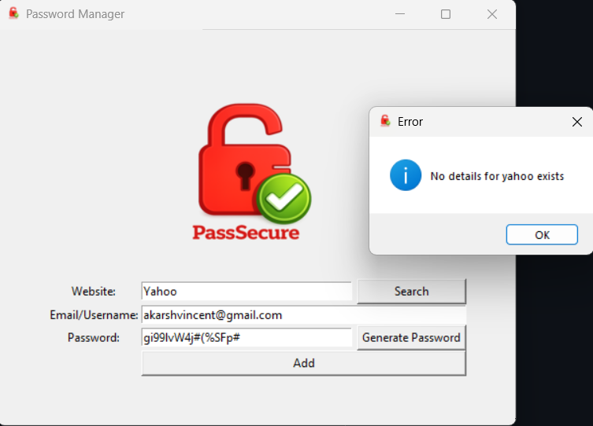

# Password Manager (Python + Tkinter)

## Overview
A GUI-based password manager that allows users to securely store and retrieve credentials for websites and applications.

## Features
- Random strong password generation
- One-click clipboard copy (Pyperclip)
- Secure file-based storage
- Simple and clean Tkinter UI

## Tech Stack
- Python
- Tkinter
- Pyperclip
- File Handling

## How to Run
1. Clone the repository
2. Install dependencies:
pip install pyperclip
3. Run:

## Screenshots

